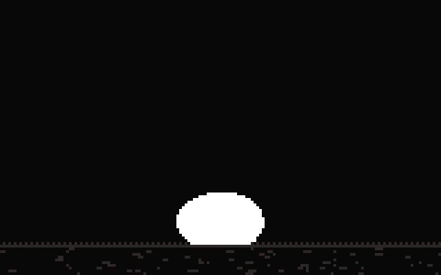
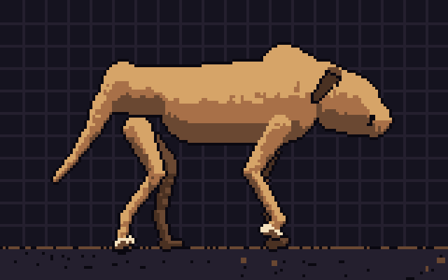
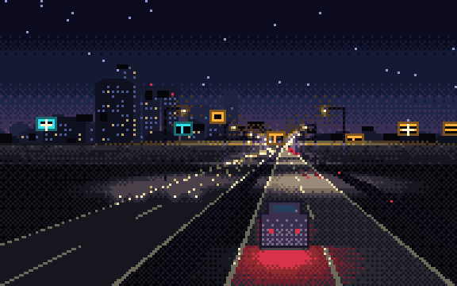

# pixels

A small platform for procedural pixel-art animations, and the animations themselves. Each
animation is a self-contained folder that registers what it is and what it needs; the platform
builds the page around it — stage, control panel, stats strip, reference playback and file browser
— out of that registration and nothing else.

There are three animations:

- [`animations/fire-explosion`](animations/fire-explosion) — a procedural explosion, drawn twice
  over, once in JavaScript and once in fragment shaders.
- [`animations/dog-walk`](animations/dog-walk) — a pixel-art mastiff whose walk is solved from an
  internal skeleton, held frame for frame against Muybridge's plate 706 of 1887.
- [`animations/highway-night`](animations/highway-night) — a night expressway seen square from the
  side, lit only by its own lamps, carrying one integer of state and a loop that closes exactly.







Every frame above came out of the animation itself — a seeded run, filmed step by step. Nothing in
any of them was drawn by hand.

PixiJS 8.19.0 is loaded from jsDelivr, pinned with a Subresource Integrity hash, and used for one
thing: presenting a pixel buffer at nearest-neighbour scale.

## What is where

```
index.html              the page shell: empty panels the platform fills in
css/styles.css          the whole look
platform/main.js        picks an animation out of the registry and starts it
platform/api.js         the registration API: defineAnimation(), knob()
platform/runtime.js     the clock, the drawing-path switch, stage rebuilds
platform/params.js      the live knob values, built from the declarations
platform/surface.js     the PixiJS pixel surface offered to drawing paths
platform/metrics.js     the numbers a page can actually measure
platform/gif.js         a GIF89a writer, used by the page and by the tools
platform/export.js      films the animation as it stands and hands over the file
platform/ui/            switcher, controls, stats strip, file browser, sheet player, furniture
animations/index.js     the registry
animations/<id>/        one animation, everything it needs and nothing else
tools/poster.mjs        writes the share image, the icons and the switcher stills
tools/gif.mjs           films a whole run at its defaults and writes out the committed GIF
tools/grid.mjs          contact sheets for looking at a run, and for holding it against the reference
tools/lib/page.mjs      the seeded page the generators drive
tools/out/              where the contact sheets land · not committed
assets/                 those generated images, committed
```

## Switching animations

The rail down the left lists every animation in the registry — its title, its tagline and a still
of one of its own frames — and picking one tears the current animation down and builds the next in
its place: the stage, the knobs, the stats, the file browser and the reference player are all
rebuilt from the new registration, and the address bar follows along on `?animation=<id>`. Nothing
about either animation is written into the switcher; it shows what it was handed. Below about
1120 px of width the rail lies down above the stage and scrolls sideways.

`?animation=<id>` also works on its own, typed or linked; without it the first animation is used.

## Run it locally

The page is plain static files, but it loads ES modules and fetches its own source for the file
browser, so it needs a server rather than a double-click. Any static server will do:

```
npx serve .
```

Then open the address it prints. An internet connection is needed for the PixiJS CDN script.

## Adding an animation

An animation is a folder under `animations/` holding its own code, its own defaults and its own
assets. It never imports from another animation, and the platform never reaches into it for
anything it was not handed.

```
animations/<id>/
  index.js       the registration — the only file the platform imports
  README.md      shown in the file browser
  assets/        reference images, if any
  …              whatever else the animation is made of
```

Add the folder, then import it in `animations/index.js` and put it in the `ANIMATIONS` array. It
appears in the switcher straight away; `node tools/poster.mjs --thumbs` gives it its picture there.

### The registration

`index.js` is one call to `defineAnimation()`. Everything is checked when the page loads and a
mistake throws immediately, rather than showing up three panels later.

```js
import { defineAnimation, knob } from "../../platform/api.js";

export default defineAnimation({
  id: "drifting-dot",
  title: "A drifting dot",
  tagline: "one pixel, going right",
  base: new URL(".", import.meta.url).href,     // so the platform can find this folder
  action: { verb: "Restart", noun: "run" },     // the button, and the word used in notes

  stage: { width: 160, aspect: 10 / 16, background: 0x000000,
           hint: "click the canvas", legend: "one dot" },
  cadence: knob("stepsPerSec"),                 // visual steps a second
  replay: 4,                                    // seconds between automatic runs, 0 for none

  knobs: [
    { group: "stage", key: "stepsPerSec", label: "cadence", default: 12,
      min: 4, max: 30, step: 1, unit: "steps/s", applies: "live" },
    { group: "dot", key: "speed", label: "speed", default: 2,
      min: 1, max: 8, step: 1, unit: "px/step", applies: "next" }
  ],

  stats: [{ key: "x", label: "x" }],
  files: [
    { path: "index.js", open: true, sub: "the registration", meta: "everything in one place" },
    { path: "README.md", sub: "what this is", meta: "fetched and rendered here" }
  ],

  backends: [
    { id: "javascript", label: "JavaScript", note: "JavaScript is drawing the frame",
      stats: [{ key: "pixels", label: "px / step" }], create: createJavascriptBackend }
  ],

  create: function (ctx) { return createDot(ctx); }
});
```

Anywhere the platform takes a number — `stage.width`, `stage.aspect`, `cadence`, `replay` — it
also takes `knob("someKey")`, and then reads that knob every time it needs the number. A knob on
`stage.aspect` is how an animation offers more than one stage shape: the buffers, the backdrop,
the box the canvas sits in and anything filmed off the stage all follow it.

### Knobs

Each knob declares its own group heading, label, type (`slider`, `toggle` or `choice`), range,
unit, default and when it takes effect: `applies: "live"` for at once, `applies: "next"` for on
the next run. The control panel is built from these declarations, `Reset to defaults` puts each
back on its declared default exactly, and the note under the panel is written from the `applies`
fields. A slider with a fractional step is driven as a whole number and divided down, so a reset
lands on the default and not a hair either side of it.

A `choice` knob has a short list of settings rather than a range: `options: [{ value, label }]`,
where every value is a number and the default is one of them. It is picked from a list and read
exactly the way a slider is read.

The values live in one object. The panel writes into it and the animation reads from it; nothing
is copied, so a knob moved on screen is read on the next step.

### Lifecycle

`create(ctx)` is called once, with `ctx = { params, width, height }`, and returns the animation:

```js
{
  detonate(spot),   // start a run — spot is {x, y} in stage pixels, or nothing for its own choice
  reset(spot),      // clean start: at boot, after a resize, after a change of drawing path
  advance(),        // one step forward
  offset(),         // optional — {x, y}, a whole-pixel shift the frame is laid down at
  stats(),          // optional — the numbers declared in `stats`
  resize(w, h),     // optional — the stage size changed
  backdrop()        // optional — a canvas drawn behind every frame, remade on each resize
}
```

The platform calls `advance()` at the declared cadence, `detonate()` when the replay gap runs out
or the stage is clicked, and `reset()` whenever the picture has to start over.

### Drawing paths

An animation registers one backend or several. With more than one the platform renders the switch
in the stats strip; with one it renders nothing. A backend's `create(ctx)` is given
`ctx = { params, scene, surface, width, height }` — `scene` is what `create()` returned above, so
a backend and its animation can share whatever they like — and returns:

```js
{
  canvas,               // the element shown while this path is drawing
  draw(),               // build the frame from the scene
  present(dx, dy),      // put it on screen, shifted by whole pixels
  readFrame(),          // Uint8Array of RGBA, for frame-by-frame comparison
  upload(),             // optional — hand a finished buffer to the surface
  setBackdrop(canvas),  // optional
  resize(w, h),         // optional
  stats(),              // optional — the numbers declared in the backend's `stats`
  gpuMs(),              // optional — measured GPU time for the last step, or -1
  env                   // optional — {label: value} rows for the environment strip
}
```

`surface` is a PixiJS-backed pixel surface: a canvas the size of the stage, blown up with
nearest-neighbour scaling, with a backdrop behind the frame. A path that produces a pixel buffer
in JavaScript uses it and does not touch PixiJS itself; a path that owns its own canvas ignores
it.

If a path cannot start, its `create()` throws with the reason. The platform disables its button,
says why under the stats, and carries on with the others. If none start, the page says so.

### Optional extras

- **`palette`** — `{ colours, lockKnob, title }`. Draws the swatch strip under the reference
  playback and names the colours the animation holds itself to.
- **`reference`** — a sheet of frames the platform plays back beside the stage at the same cadence,
  restarted on every run: `{ image, columns, rows, frames, frameSize, alt, credit, links, legend,
  sourceLegend }`. `frameSize` can be split into `frameWidth`/`frameHeight`, and a sheet with a
  margin or gutters declares `origin: { x, y }` and `gap: { x, y }`. `player: { width, height }`
  sizes the canvas it is played back in and `pixelated: false` turns off nearest-neighbour scaling,
  which is what a photographic plate wants and a hand-drawn sprite sheet does not.
- **`stats`** — `[{ key, label, format }]`, read from `scene.stats()` each step and shown in the
  strip. A backend declares its own the same way and they show as `n/a` while another path draws.
- **`files`** — `[{ path, sub, meta, open, alt, caption, pixelated }]`, the list the file browser
  shows. Paths are relative to the animation's folder and are fetched from the server, so what is
  on screen is what is being run. Only these files appear; nothing of the platform does.
- **`poster`** — which frame stands in for the animation as a still, and how a whole run of it is
  filmed: `{ step, spot, backend, icon: { x, y, size }, film: { steps, scale, file } }`. `step` is
  how many steps into a run the frame is taken, `spot` where to start that run, `backend` which
  path draws it, and `icon` a square cut out of the same frame for the favicons, in stage pixels.
  All are optional; without them the platform takes a dozen steps into a centred run on the default
  path and cuts the middle of the stage. `film` says how long a whole run is, how far to magnify it
  for the committed copy, and where that copy lives — `assets/<id>.gif` unless the animation says
  otherwise. `film.steps` may be `knob("someKey")`, and `film.cycles` multiplies it, which is how
  the export button knows to film a longer blast when the blast-length knob has been moved.
  Declaring `film` puts the GIF button in the header. The runtime exposes both mechanisms as
  `window.pixels.poster({ step })`, which holds the clock still and hands back one canvas, and
  `window.pixels.record({ steps, onFrame })`, which walks a whole run and hands over each frame as
  it is drawn.

### Iterating on one

An animation that only exists in motion is hard to work on: by the time you have seen a frame it
has gone. `tools/grid.mjs` lays a whole run out flat instead — one PNG, one cell per step, the
frames the page actually draws, posed out of a seeded run so the same command gives the same sheet
every time. Sheets land in `tools/out/`, which is not committed: they are for looking at, not for
keeping.

```
node tools/grid.mjs --animation dog-walk
node tools/grid.mjs --animation dog-walk --set legLength=20,strideLength=34,skeleton=on \
  --steps 0-11:2 --columns 3 --scale 3
node tools/grid.mjs --animation dog-walk --compare
node tools/grid.mjs --animation fire-explosion --compare --scale 2
node tools/grid.mjs --animation fire-explosion --backend shaders --from 6 --count 8 --stride 3
```

`--set` moves knobs before anything is drawn and names them in the caption, so a sheet always says
what made it; a key the animation does not declare is an error rather than a silently ignored
typo. `--steps` takes `0-49:2` for a range and a stride or `0,4,8` for a list, and `--from`,
`--count` and `--stride` do the same thing one flag at a time. `--columns`, `--scale`,
`--no-labels`, `--backend`, `--seed` and `--out` do what they say; `node tools/grid.mjs --help`
prints the lot.

**`--compare` is the one to reach for.** It lays the animation's registered reference sheet out
above its own frames, column for column: a reference row, then the live row it should match, then
the next pair. The reference is stepped exactly the way the player beside the stage steps it — one
frame per step, wrapping when the sheet is shorter than the run — so the two rows are showing the
same instant, and a run that has drifted out of its reference's arc shows up as a diagonal drift
down the sheet rather than as a feeling that something is off.

## The share image and the icons

`assets/og.png`, the favicons and `favicon.ico` are frames of the animation, not artwork and not
reference material: the generator boots the real page with a seeded random source, poses the
declared poster frame, and cuts the images out of it at whole-number scales so no pixel is
softened. They are committed, because the site is static.

```
node tools/poster.mjs                              regenerate everything
node tools/poster.mjs --thumbs                     a still per animation, for the switcher
node tools/poster.mjs --contact sheet.png          contact sheet of candidate steps
node tools/poster.mjs --animation dog-walk --contact sheet.png   …for another animation
node tools/poster.mjs --step 26                    try a step without changing the declaration
```

`--thumbs` walks the registry and writes `assets/<id>-thumb.png` for every animation in it, each
one that animation's own poster frame at twice its size. Those are the pictures in the switcher.

It needs Playwright with Chromium (`npm i playwright && npx playwright install chromium`) and
serves the repository itself on a loopback port. The same seed and the same step give the same
bytes every run. The `og:` and `twitter:` tags in `index.html` point at the result; they are
site-level, so one animation's poster stands for the site.

## The animated GIF

The **GIF** button beside the stage does not hand out a file somebody made earlier. It films the
animation as it stands — the knobs where the visitor left them, the drawing path in use, the
cadence on the clock — and writes the file in the browser, out of `platform/gif.js`, the same
encoder the command-line tool uses. Nothing is fetched and nothing is uploaded. The button counts
the steps on its own face while it works and the file arrives as `<animation-id>.gif`.

How long a run is comes off the animation's own declaration read through the knobs, so a longer
blast or a longer stride films for longer: the explosion's film is its blast-length knob, the dog's
is two of its stride knob. The magnification is a whole number chosen so the file lands near 640
pixels wide, and no capture runs past 150 frames — the sliders cannot reach that, but the ceiling
is there so no animation can ask the browser for a film it cannot hold. When it bites, the button
says so.

Each capture borrows the random source and seeds it, so the same knobs give the same file twice
running.

`assets/fire-explosion.gif` and `assets/dog-walk.gif` are the same thing made ahead of time, at the
declared defaults, so this file and the social preview have something to show:

```
node tools/gif.mjs                            regenerate assets/<id>.gif
node tools/gif.mjs --animation dog-walk       film another animation
node tools/gif.mjs --scale 6                  bigger blocks
node tools/gif.mjs --out /tmp/try.gif         somewhere else
```

Either way the palette goes straight into the file's colour table, so the colours in the file are
the ones the animation draws with — nothing is dithered, resampled or reduced, and a frame that
matches the one before it is stored as the rectangle that changed. The command-line run is
deterministic in the same way the poster is: the same seed gives the same bytes.

## What the stats panel measures

The strip is read four times a second. A number the drawing path in use cannot produce is shown as
`n/a` rather than as a zero:

- frames a second, both current and averaged over the last second
- frame time in milliseconds, average and worst, over the last second
- the cost of one visual step, the upload of a finished buffer to a texture where there is one,
  and the gap that covers handing the frame to the GPU
- where a path measures it, the time the graphics card spent on its passes, via
  `EXT_disjoint_timer_query_webgl2` where the browser offers it
- the last step cost measured on each path, side by side, so the two can still be compared after
  switching
- whatever counts the animation and its paths declare
- the environment: which path is drawing, stage size, renderer, device pixel ratio, the JavaScript
  heap where the browser offers one (Chrome only), whatever the paths report about themselves, and
  the GPU name where the driver allows it to be read, via `WEBGL_debug_renderer_info`

A step cost measured on a path that only sets uniforms and issues draw calls is small by
construction: the drawing happens on the card afterwards. The pass time is the figure to hold
against it, and it exists only where the timer extension does — software renderers usually do not
have it, and there the cell reads `n/a` and frames a second is the honest comparison.

No browser reports GPU utilisation, VRAM or driver queue depth to a web page, and nothing here
guesses at them. These are the classic obtainable numbers: wall-clock timing around the page's own
code, plus counts of its own work. Anything the driver defers shows up only indirectly, as time
the next frame has to wait for. The measurement itself is a handful of clock reads a frame, and
the readout updates on a timer rather than every frame, so it does not meaningfully cost what it
is reporting.

## Deploying

The site is served from Cloudflare Pages at <https://pixels.handgemacht.ai>. A deploy is a direct
upload of the repository root, and from the project's server it takes two settings in the
environment to be repeatable:

```
NODE_OPTIONS="--dns-result-order=ipv4first" \
CLOUDFLARE_ACCOUNT_ID=10ffc83d63d85bc2f310685b64e54d3d \
npx wrangler pages deploy . --project-name pixels --branch main
```

Everything under the root goes up, `.gitignore` or not, so empty `tools/out/` before deploying
rather than publishing a pile of contact sheets.

`CLOUDFLARE_API_TOKEN` is loaded by direnv out of `~/.config/direnv/handgemacht.private.envrc`,
and it is accepted only from an allowed client address: the server's IPv4 one, not its IPv6. Node
resolves the API host to both families and races them per connection, so an unqualified run fails
intermittently with error 9109, `Cannot use the access token from location: …`, naming whichever
IPv6 address that connection went out on. `--dns-result-order=ipv4first` settles the race on the
family the allowlist knows. `CLOUDFLARE_ACCOUNT_ID` names the account outright and so skips the
`/accounts` listing wrangler otherwise makes first — the call 9109 surfaces on — and
`--branch main` files the upload as production rather than as a preview.

**Every deploy needs the edge cache cleared afterwards.** Pages serves the site with
`cache-control: max-age=14400`, so the custom domain holds each path for four hours whatever has
landed behind it. A file that changed goes on being served in its old form; a path that is new is
worse, because a request arriving for it while the deploy is still landing gets the 404 fallback —
the page's own HTML — cached under that path for the same four hours. Every visitor then sees a
stale site, or one whose modules will not load, while the `*.pages.dev` deployment URL is
perfectly fine, which makes it easy to miss. Purge every path the deploy touched:

```
curl -X POST "https://api.cloudflare.com/client/v4/zones/36ccef1bc71583c52483121881f9a397/purge_cache" \
  -H "Authorization: Bearer $CLOUDFLARE_API_TOKEN" -H "Content-Type: application/json" \
  --data '{"files":["https://pixels.handgemacht.ai/platform/new-thing.js"]}'
```

Then load the site and check the console, rather than trusting the deploy's own success message.

## Licence

The platform and the animations are original work. Reference material carries its own licence,
named in each animation's own README — for `fire-explosion`, a CC0 1.0 sprite sheet and a
public-domain photograph; for `dog-walk`, a public-domain Muybridge plate; for `highway-night`,
five CC0 1.0 files — three photographs, a pixel-art car sprite and a pixel-art animation.
